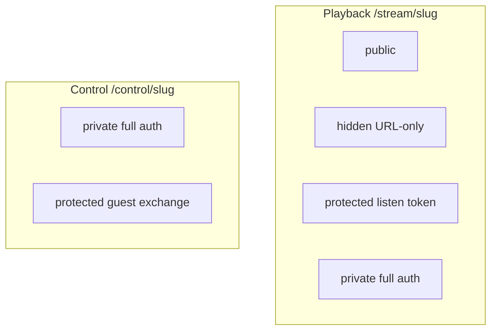

# Struna Access



Playback and control access are **fully independent** per Struna. Plume’s remote desk is `/control/{slug}`; the listen / player UI is `/player/{slug}` — see [uri-routing](../interfaces/uri-routing.md).

## Playback (listening)

| Mode | Legacy players | Web / Plume |
|------|----------------|-------------|
| **public** | `/stream/lofi` | Works (anonymous player OK) |
| **hidden** | `/stream/lofi` (same gate) | Works via shared `/player/{slug}` URL; **not** on listen lists |
| **protected** | `/stream/lofi?token=...` (MVP) | Same listen token on `/stream/{slug}?token=` (or Plume player that passes it). UI session cookie is **BFF/control only** — not listen ACL |
| **private** | Not compatible (no OIDC in VLC) | Full auth |

### Protected token delivery

| Method | Example | MVP |
|--------|---------|-----|
| Query param | `/stream/lofi?token=abc` | **Yes** |
| HTTP Basic | token as password | v0.2 eval |
| Path segment | `/stream/lofi/abc` | v0.2 eval |

Token generated at creation (**Kithara-owned** Struna secret); owner can rotate. Query params may appear in logs — see [ADR 009](../adrs/009-struna-access-and-routing.md). Listen tokens stay query/Basic secrets for legacy players — **no** Bearer exchange (players cannot do that well).

## Control (queue / skip)

| Mode | Mechanism |
|------|-----------|
| **private** | Authenticated **durable** or **managed** users with control permission |
| **protected** | Short **guest code** → Kithara creates an **ephemeral guest user** + mints JWTs for that user |
| **public** | **Not supported** |

### REST discovery lists

| Path | Filter |
|------|--------|
| `GET /api/streams/listen` | Principal may listen (**public** for all; **hidden** omitted except owner/grant/control-guest; protected/private → owner **or** grant) |
| `GET /api/streams/control` | Principal may DJ (owner **or** grant **or** protected-control ephemeral guest for that Struna) |

Unauthenticated open-playback reads (public **or** hidden — URL is enough; no secrets):

| Path | Notes |
|------|--------|
| `GET /api/streams/by-slug/{slug}` | Metadata when playback is public/hidden; otherwise `404` |
| `GET /api/streams/by-slug/{slug}/now-playing` | Same gate; powers anonymous Plume player polls |

Today’s ACL is owner + grant (+ guest for protected control). **Phase 6 contract:** owner-only grant CRUD under `/api/streams/{id}/grants` and managed-user **permission ceiling** enforcement on create / grant mutations — see [auth](../interfaces/auth.md) and [rest-api](../interfaces/rest-api.md). Listen-token holders are gated on `/stream/{slug}` (Phase 5), not via these lists.

### Grant CRUD (Phase 6)

Owner of the Struna only. Persist `StrunaControlGrant`.

| Method | Path | Body / notes |
|--------|------|--------------|
| GET | `/api/streams/{id}/grants` | List grantees |
| POST | `/api/streams/{id}/grants` | `{ "user_id": "…" }` — durable/managed user |
| DELETE | `/api/streams/{id}/grants/{userId}` | Revoke |

### Managed permission ceiling (Phase 6)

Static clients advertise a ceiling at Register; Kithara stores it on the managed user/binding. Create-struna and grant mutations for managed principals **deny** anything above that ceiling. User-aware clients (Plume) are not constrained by a static-module ceiling.
### Protected control: guest code → ephemeral guest user

Do **not** send the short guest code on every API call — it is brute-forceable and sticky in logs/history.

One guest code is generated **per Struna** (owner can rotate). Each successful exchange creates a **new ephemeral guest user** bound to that Struna. Kithara **mints** access (+ refresh) JWTs for that user. When the Struna is deleted/cleaned up, Kithara destroys all ephemeral guest users created for that Struna.

**Rotating** the guest code **only blocks new joins**. Existing ephemeral guests keep their sessions until the Struna is deleted (or their JWT refresh window ends without a valid path — still tied to Struna life for destruction of the user row).

```mermaid
sequenceDiagram
  participant Guest
  participant Client as UI_client
  participant Kithara
  Guest->>Client: enters short guest code
  Client->>Kithara: POST guest/exchange
  Note over Kithara: rate-limit verify code
  Note over Kithara: create ephemeral guest user for this joiner
  Kithara-->>Client: Bearer JWT + refresh for that user
  Client->>Kithara: play queue skip with Bearer
  Note over Kithara: verify Kithara-minted JWT; ACL = this Struna
  Note over Kithara: on Struna DELETE — destroy ephemeral guests
```

| Piece | Role |
|-------|------|
| **Guest code** | Short, human-shareable, Kithara-owned; used **only** at exchange (rate-limited); one per Struna until rotated |
| **Ephemeral guest user** | Kithara-owned `User` row (no auth-module binding); one **per joiner**; destroyed with the Struna |
| **Guest JWT (+ refresh)** | Kithara-signed credentials for that ephemeral user; refreshable until Struna teardown |

Party DJ is still not a durable account — but it **is** a real row in Kithara’s user table for ACL, search-cache ownership, and refresh. See [glossary](../glossary.md) for naming vs **managed users**.

**Security:** rate-limit exchange; JWT TTL + refresh; owner **rotates** the guest code to stop **new** joiners (existing guests unaffected until Struna delete). Endpoint: [rest-api](../interfaces/rest-api.md).

## Example combinations

| Playback | Control | Use case |
|----------|---------|----------|
| public | private | Open radio; owner DJs |
| public | protected | Party — anyone listens; guests exchange code then queue |
| hidden | private | Share a player URL; strangers cannot browse it on home |
| protected | protected | Listen token URL + guest exchange for control |
| private | private | Fully locked |

## Bots / static clients

**Managed users** (day-to-day control) plus planned **mTLS module admin** for create/revoke — see [clients](clients.md). For listen-only bots, a **protected** Struna with a known listen token also works.

**Related:** [interfaces/http-stream-output.md](../interfaces/http-stream-output.md) · [interfaces/auth.md](../interfaces/auth.md) · [ADR 009](../adrs/009-struna-access-and-routing.md)

**Read next:** [source-modules.md](source-modules.md)
