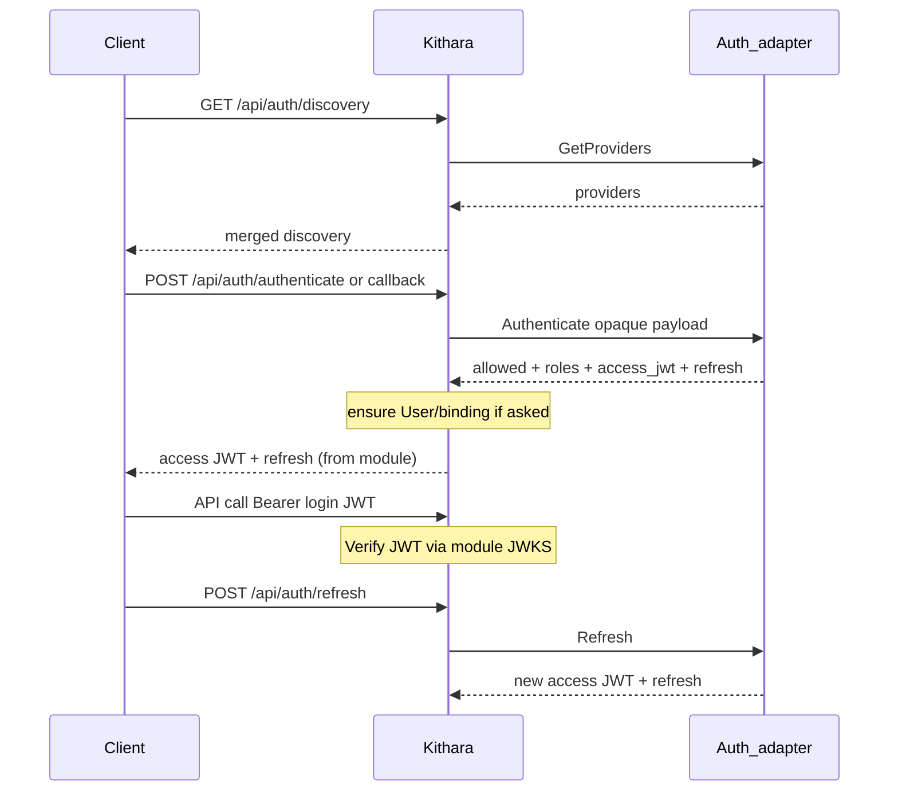

# Auth API and Permissions

Clients authenticate through **Kithara**, not by calling auth adapters on the public edge. Plume is optional — any client can use the same REST flow. Adapters stay on the internal gRPC plane.

**Token model:**

| Class | Who mints | Who verifies | Use |
|-------|-----------|--------------|-----|
| **Login JWT** (+ refresh) | Auth module (issue or forward) | Kithara via module JWKS | Durable users (Bes/Argus/…) |
| **Ephemeral guest JWT** (+ refresh) | **Kithara** | Kithara via its signing key | Guest-code joiners on a protected-control Struna |
| **Managed-user credentials** | Static client admin flow (join secret) | Kithara | Beak-style tenancy users |

Kithara does **not** mint auth-module **login** JWTs. It **does** mint JWTs for **ephemeral guest users** after guest-code exchange. **Join secrets** authenticate modules (register + static admin) — not end-user credentials.

## Discovery

`GET /api/auth/discovery` — Auth Orchestrator merges `GetProviders()` from registered adapters. There is no built-in provider.

MVP: one `form_schema` provider from **Bes** (`ProviderDescriptor.ui.form_schema` with typed fields). Client (e.g. Plume) renders from the field list — adapters do **not** host login HTML. Clients switch on the `ui` oneof case only; they must not branch on provider `id`.

Redirect-style providers (Argus) set `ui.redirect.authorize_url`. The browser returns to **Kithara**, not to Plume or the adapter. Kithara forwards the opaque callback payload to that adapter’s `Authenticate`. Path: `/api/auth/callback` under `/api/*` (no separate public `/auth` prefix for MVP).

## Authenticate, refresh, and API access

| Method | Path | Description |
|--------|------|-------------|
| POST | `/api/auth/authenticate` | Opaque payload → module `Authenticate` → if allowed, **module-issued (or forwarded) JWT** + refresh |
| POST | `/api/auth/refresh` | Opaque refresh → **module** `Refresh` **or** host guest remint (see below) |
| GET/POST | `/api/auth/callback` | Browser return for redirect flows; same path as authenticate — **not** OIDC-named |

Kithara does not mint login JWTs and does not interpret provider-specific crypto beyond verifying signatures with the module’s registered JWKS. It routes the bag, persists binding data when asked, and enforces Struna ACLs using claims/roles from the verified JWT (plus DB).

- **Refresh (login):** entirely on the auth-module side.
- **Refresh (ephemeral guest — Phase 6 / GUEST-REF-001):** host path on the same `POST /api/auth/refresh`. Detect Kithara guest (e.g. `bardie_provider=kithara.guest`), validate + remint until Struna teardown / capped lifetime — do **not** dial an auth adapter.
- Revoke / logout: module- and IdP-dependent for login users; guests die with the Struna. Rotating the guest code **does not** kill existing guests — it only blocks new exchanges.
- **`must_rotate_credentials`:** seeded admins must change creds on first login; optional force-rotate for any durable user later (Phase 6 / AUTH-ROT-001).

## Bootstrap admin (`seedAdmin`)

When the user DB is empty, Kithara may call `SeedAdmin` on an auth module that advertised the `seedAdmin` capability (Bes). The module creates credentials, Kithara persists the user, and Kithara logs the module’s welcome text (one-time secret) to the **Kithara container log**. See [grpc-auth-adapter](grpc-auth-adapter.md).

## Guest control (protected Struna)

Short **guest codes** are Kithara-owned bootstrap secrets — **exchange only**, never sent on every control call.

| Method | Path | Description |
|--------|------|-------------|
| POST | `/api/streams/{id}/guest/exchange` | Body: guest code → create **ephemeral guest user** + Kithara-signed JWT (+ refresh) |

Each exchange = **one new ephemeral guest user** for that joiner, scoped to the Struna. Destroyed when the Struna is deleted. Details: [struna-access](../domains/struna-access.md).

## Secrets ownership

| Secret | Owner | Purpose |
|--------|-------|---------|
| Login access JWT / refresh | **Auth module** (issue or forward) | Durable API clients; Kithara verifies via module JWKS |
| Ephemeral guest JWT / refresh | **Kithara** (mint) | Guest joiners after code exchange. Signing key: env if set, else auto-generated + persisted |
| Guest code | **Kithara** (on Struna) | Bootstrap only — exchange for ephemeral guest session |
| Listen token | **Kithara** (on Struna) | Protected playback `/stream/{slug}?token=` (no exchange) |
| **Join secret** | **Kithara** config | Module identity — `Register`, heartbeats, static managed-user admin |

## User kinds (one DB)

Thin `User` rows live in Kithara’s database. Kind matters for lifetime and token minting:

| Kind | Lifetime | Tokens | Binding |
|------|----------|--------|---------|
| **Durable user** | Until deleted | Auth-module JWT | `UserAuthBinding` |
| **Managed user** | Until module revokes | Per-user credentials (static client) | `managed_by_module` + tenancy ref |
| **Ephemeral guest user** | Until Struna delete | Kithara-minted JWT | None (Struna-scoped) |

See [glossary](../glossary.md). Auth modules have no separate user DB.

## Client modules: user-aware vs static

Every client module **Registers over gRPC** like any other module ([grpc-module-registry](grpc-module-registry.md)). Then:

| Mode | Meaning | Credential on `/api` |
|------|---------|----------------------|
| **user-aware** | End users log in | Bearer **login JWT** from an auth module |
| **static** | Owns many **managed users** | **Join secret** (admin only) + **per-user credentials** (day-to-day) |

See [clients](../domains/clients.md).

## Permission / ACL (MVP)

| Principal | Create Struna | Control a Struna | Search + use own result refs |
|-----------|---------------|------------------|------------------------------|
| **Durable user** (registered via auth module) | Yes | Owner, or **grant** from owner (private); protected-control guests use guest path | Yes |
| **Managed user** (static UI) | Up to module’s **advertised ceiling** (typical: create + manage own Strunas) | Same, within ceiling; create-time or runtime entity scope ≤ ceiling; unset → default to advertised set | Yes |
| **Ephemeral guest user** | **No** | **Only** the Struna whose guest code they exchanged | Yes (cleared on Struna teardown) |

**Ownership:** stored on the Struna model (`OwnerUserId` or equivalent) at create time = creator.

**Private control:** owner **plus** explicit grants to other durable/managed users. **Phase 6:** owner-only CRUD under `/api/streams/{id}/grants` (persist `StrunaControlGrant`). Ephemeral guests are not on that list — they use the protected guest-code path instead.

**Static module ceiling (Phase 6 enforce):** declared at Module Registry handshake and stored as `permission_ceiling` for managed users. Create-struna and grant mutations for managed principals must stay ≤ ceiling (deny above). When the static UI creates a managed user it may narrow scope; it **cannot** raise rights above the advertised ceiling. If it sets nothing, Kithara applies the advertised defaults. User-aware clients are unconstrained by ceiling.

## Permission matrix (summary)

| Action | Who |
|--------|-----|
| Create Struna | Any durable user; managed users if ceiling allows |
| Control (private) | Owner + grants |
| Control (protected) | Ephemeral guests for **that** Struna only; also owner/grants as durable principals |
| Listen (private) | Per Struna listen ACL / auth |
| Guest code exchange | Valid code + rate limit (no prior login) |
| Use search result refs | **Same principal** that ran the search |
| Link auth providers | Durable authenticated user |

**Org roles** may arrive in login JWT claims and/or from the module’s authenticate result stored on the binding. **Provider priority tier-list** arbitrates when multiple bindings disagree. **Struna ACLs** always live in Kithara.

## Join secrets

Long-lived secrets in Kithara config for **every** module (source, auth, client). Same credential authenticates `Register` / heartbeats at **container startup** and, for **static** clients, managed-user admin. Ordinary Struna/API work for static modules still uses each managed user’s own credentials.

**Related:** [domains/auth-adapters.md](../domains/auth-adapters.md) · [grpc-auth-adapter.md](grpc-auth-adapter.md) · [struna-access](../domains/struna-access.md) · [ADR 007](../adrs/007-auth-adapter-modules.md)

**Read next:** [rest-api.md](rest-api.md)
