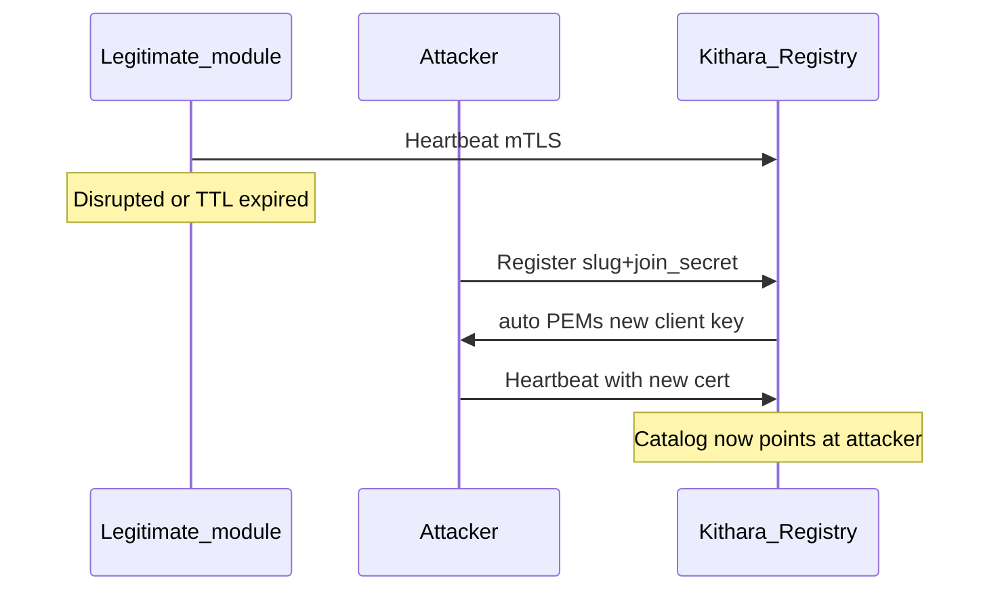

# Security audit (MVP)

Living audit of trust assumptions across the Module mesh, auth vertical, library/storage, and guest paths. Not a full product pen-test — focused on **who can become trusted**, **who gets admin**, and **what tokens/keys actually do**.

**Last review:** Full-stack MVP including Plume (Jul 2026). Prior: Phases 4–6 backend audit; Phases 1–3 index below.

**Remediation status:** Phase 4–6 product remediations remain **closed** / partial as in the status table. Plume Phases 1–6 **feature-complete** (`/player` autoplay is intentional). Soft residuals + Plume findings → Phase 8. `MESH-REG-*` stays ops + backlog.

### ID scheme

`SURFACE-TOPIC-NNN` — plane → component → stable sequence (same grammar as `MESH-REG-*`). Severity lives in tables, not in the id. Residuals continue the parent topic (`AUTH-ROT-001` → `AUTH-ROT-002`), never a dump prefix.

| Surface | Owns |
|---------|------|
| `MESH` | Registry, Channel, CA / TLS bootstrap |
| `AUTH` | Bes, JWT mint, JWKS, rotate, roles, harness routing |
| `GUEST` | Guest refresh / exchange / lockout |
| `LIB` | Tune / blob ownership |
| `NECK` | Jobs, TrackStatus, PCM, orphan recovery |
| `STREAM` | ICY listen-token |
| `PLUME` | BFF session, player, CSRF/CSP, UI policy |
| `META` | QA / docs / ops process debt |

Historical aliases (`SEC-*`, `NEW-*`, `DES-*`, `KI-*`, `QA-*`, `DOC-*`, `OPS-*`) → [alias table](#historical-aliases).

---

## Trust model (mesh)

| Stage | What authenticates | What does not |
|-------|--------------------|---------------|
| `Register` | Join secret for that **slug** (`BARDIE_JOIN_SECRETS`) | Prior client cert (unless caller happens to present one) |
| Steady state (`Heartbeat`, work RPCs) | mTLS client cert signed by host CA | Join secret |
| Host CA / server TLS | Files under `BARDIE_GRPC_TLS_DATA_PATH` | Ephemeral in-memory-only CA when the path is empty |

**Design intent (agreed):** after Register, this module container speaks only with its paired Kithara, and that Kithara dials only that slug/ID. Privileged RPCs (`SeedAdmin`, …) rely on **channel identity**, not a second app-level ACL on the module.

**Auto** bootstrap may return `client_private_key_pem` on `RegisterResponse` — **private mesh / trusted LAN only**. Prefer **preshared** when gRPC may cross untrusted networks ([grpc-module-registry](../interfaces/grpc-module-registry.md)).

### What persists across Kithara restart

| Material | Durable? | Notes |
|----------|----------|--------|
| Host CA + gRPC server cert | **Yes**, if `TlsDataPath` is on a volume | Generate-once; load on later boots |
| Module client certs (auto) | **No** on the host | Re-issued on every successful `Register`; module must store PEMs |
| Module client certs (preshared) | Operator-placed files | Not emitted on the wire |
| Registry + harness catalogs | **No** | In-memory; heartbeat TTL; empty after restart |

---

## Finding index (Phases 1–3 review)

| ID | Sev | Area | Summary | Fix phase | Status (Jul 2026) |
|----|-----|------|---------|-----------|-------------------|
| [GUEST-REF-001](#guest-ref-001--guest-refresh-tokens-are-dead-on-arrival) | **P0** | Guests | Guest refresh minted but `/api/auth/refresh` only dials auth modules | **6** | **Fixed** |
| [LIB-TUNE-001](#lib-tune-001--ensuretune-skips-storage_key-ownership) | **P0** | Library | `EnsureTune` does not call `BlobKeyLayout.EnsureKeyOwnedBy` | **6** | **Fixed** |
| [AUTH-ROT-001](#auth-rot-001--must_rotate_credentials-is-advisory-forever) | **P0** | Bes | Seed sets rotate flag; Authenticate never enforces / no password-change | **6** → **8** | **Fixed** — `UpdateUserBinding` + `bind_form`; host control gate (AUTH-ROT-002) |
| [AUTH-ROLE-001](#auth-role-001--every-successful-login-mints-rolesadmin) | **P0** | Bes / AuthZ | Every mint hardcodes `roles=[admin]` | **6** | **Fixed** |
| [AUTH-JWKS-001](#auth-jwks-001--jwks-resolver-uses-sync-over-async) | **P1** | Auth JWT | `GetAwaiter().GetResult()` in signing-key resolver | **6** | **Fixed** |
| [GUEST-XCHG-001](#guest-xchg-001--guest-exchange-unauthenticated--no-rate-limit) | **P1** | Guests | Open `POST …/guest/exchange`; short codes brute-forceable | **6** | **Partial** — 10/min rate limit; lockout → GUEST-XCHG-002 |
| [MESH-CHN-001](#mesh-chn-001--work-port-mtls-trusts-ca-only--not-hostslug-pinned) | **P1** | Module.Channel | Work-port accepts any mesh-CA client cert; host dials skip server pin | **4** | **Fixed** |
| [MESH-REG-001](#mesh-reg-001--slug-takeover-via-join-secret-auto) | High* | Registry | Join secret + Register window → slug takeover (auto) | Ops + backlog | **Open** |
| MESH-REG-002 | Residual | Registry | Auto private-key-on-wire | Ops (`preshared`) | **Open** |
| MESH-REG-003 | Residual | Registry | Cert CN = slug, not instance | Tied to MESH-REG-001 | **Open** |
| MESH-REG-004 | Residual | Registry | Ephemeral TLS data dir → re-key storm | Ops (durable volume) | **Open** |

\*High when join secrets leak or `:5000` is reachable beyond a private overlay; expected residual for auto on a closed Compose network.

---

## Remediation status (Phases 4–6)

| ID | Code evidence | Remaining |
|----|---------------|-----------|
| **GUEST-REF-001** | `GuestJwtService.TryRefreshAsync`; `POST /api/auth/refresh` short-circuits `kithara.guest` | — |
| **LIB-TUNE-001** | `LibraryService.EnsureTune` → `BlobKeyLayout.EnsureKeyOwnedBy` | — |
| **AUTH-ROT-001** | `SeedAdminBinding` + `UpdateUserBinding` / `bind_form`; Authenticate login-only | — |
| **AUTH-ROLE-001** | Roles from binding; SeedAdminBinding = admin once; default `user` | — |
| **AUTH-JWKS-001** | JWKS snapshot + hosted refresh; resolver reads cache only | — |
| **GUEST-XCHG-001** | `guest-exchange` fixed window 10/min per IP+Struna | — |
| **MESH-CHN-001** | `CertificateIdentity.IsHostClient` inbound; `expectedServerIdentity` outbound | — |
| **AUTH-ORCH-001** | Auth harness discovery `provider_id → module` map | — |

### Soft residuals / polish (Phases 4–6 audit → Phase 8)

| ID | Sev | Summary | Owner |
|----|-----|---------|-------|
| **AUTH-ROT-002** | P1 | Host denies control while `must_rotate` (`403` + `credentials_rotation_required`) | **Fixed** (Phase 8) |
| **NECK-JOB-001** | P2 | TrackStatus disconnect without terminal event can orphan Neck jobs | Phase 8 / Neck polish — drives [NECK-SWP-001](known-issues.md#neck-swp-001--orphan-writer-sweep-runs-on-every-play-including-new-strunas) / [kithara#26](https://github.com/Bardie-radio/kithara/issues/26) |
| **GUEST-XCHG-002** | P2 | Guest failure lockout (5 failures → 15 min) | **Fixed** (Phase 8) |
| **STREAM-TOK-001** | P2 | Listen-token compare not constant-time | **Fixed** — `CryptographicOperations.FixedTimeEquals` |
| **AUTH-JWKS-002** | P2 | JWKS snapshot cold window at boot | **Fixed** — Register awaits first JWKS refresh |
| **META-QA-001** | P1 | No host E2E; Bes/Magpie have no module-local tests | Phase 8 ([kithara#22](https://github.com/Bardie-radio/kithara/issues/22), bes#6, magpie#2) |
| **META-DOC-001** | P3 | Plan/module docs lag code (incl. `/player` autoplay wording) | Phase 8 ([kithara#23](https://github.com/Bardie-radio/kithara/issues/23), [plume#12](https://github.com/Bardie-radio/plume/issues/12), bes#7, magpie#3) |
| **META-OPS-002** | P2 | Final images: Ubuntu aspnet + full apt `ffmpeg`; Alpine + bare-minimum libav | Phase 8 ([kithara#33](https://github.com/Bardie-radio/kithara/issues/33), [magpie#6](https://github.com/Bardie-radio/magpie/issues/6), [plume#13](https://github.com/Bardie-radio/plume/issues/13), [bes#10](https://github.com/Bardie-radio/bes/issues/10)) — [known-issues](known-issues.md#meta-ops-002--final-images-bloated-ubuntu--full-ffmpeg) |
| **META-OTEL-001** | P1 | Local Compose omits `OTEL_EXPORTER_OTLP_ENDPOINT` | Phase 8 ([kithara#34](https://github.com/Bardie-radio/kithara/issues/34)) — [known-issues](known-issues.md#meta-otel-001--local-compose-omits-otel_exporter_otlp_endpoint) |
| **META-OTEL-002** | P1 | `Task.Run` drops Activity (Magpie track + Neck encode) | Phase 8 ([kithara#36](https://github.com/Bardie-radio/kithara/issues/36)) — [known-issues](known-issues.md#meta-otel-002--taskrun-drops-activity-context-magpie--neck) |
| **META-OTEL-003** | P2 | Span attrs / Magpie stages / listen tags lag ADR 008 | Phase 8 ([kithara#35](https://github.com/Bardie-radio/kithara/issues/35)) — [known-issues](known-issues.md#meta-otel-003--span-attrs--stage-coverage-lag-adr-008) |

### Full-stack review (Plume + docs) — Jul 2026

| ID | Sev | Summary | Status |
|----|-----|---------|--------|
| **DOC-STREAM-001** | P1 | `struna-access.md` Web/Plume protected = “Session/cookie”; code still needs `?token=` | **Fixed** — listen token vs BFF cookie clarified |
| **PLUME-SEC-001** | P2 | No Content-Security-Policy on Plume host | **Fixed** — default CSP middleware |
| **PLUME-SEC-002** | P2 | BFF state-changing routes: SameSite only (no antiforgery tokens) | **Fixed** — `X-CSRF-TOKEN` / form antiforgery on unsafe `/bff/*` |
| **PLUME-SESS-001** | P2 | In-memory session token store (multi-replica / restart) | **Deferred** — MVP single-replica (documented in Plume security-notes) |
| **GUEST-XCHG-003** | P3 | Dual guest-exchange routes (id vs slug) → separate rate-limit partitions | **Open** |

**Withdrawn — not a product bug:** former **PLUME-AUD-001** (public `/player` auto-start). **Decision (Jul 2026):** the listen/player page is expected to play on load. Track as **docs only** under [META-DOC-001](https://github.com/Bardie-radio/kithara/issues/23) and [plume#12](https://github.com/Bardie-radio/plume/issues/12): replace “audio off by default” with “`/player` autoplays; optional listen elsewhere is opt-in.”

**Plume BFF strengths (no finding):** JWTs never in browser; discovery by `ui_mode` only; control gated by session + control list; guest exchange → server session; Register + `bardie.plume` OTel; focused BFF/auth/player tests.

**Doc cluster under META-DOC-001 also includes:** Kithara Phase 7 still “Next” while Plume checklist is done; Bes ops “JWT not wired”; Magpie ytdl wording; Tune prototype path; Plume `security-notes` stale SEC claims; Harness vs Orchestrator naming; shadcn claimed but not shipped; **player autoplay vs “off by default” wording** (code intentional).

---

## GUEST-REF-001 — Guest refresh tokens are dead-on-arrival

**Severity:** P0  
**Component:** Guest JWT mint + `POST /api/auth/refresh`  
**Fix:** Phase **6**

Guest JWT service mints refresh tokens, but refresh REST only dials auth-module `Refresh`. There is no host path for the guest provider — clients hold a useless refresh.

**Remediation:** Host-side guest refresh on `POST /api/auth/refresh` — detect Kithara guest (e.g. `bardie_provider=kithara.guest`), validate refresh, remint access until Struna teardown / capped lifetime (matches locked “refresh until Struna teardown”). Do not dial auth modules for guest refresh.

---

## LIB-TUNE-001 — EnsureTune skips `storage_key` ownership

**Severity:** P0  
**Component:** `LibraryService.EnsureTune`  
**Fix:** Phase **6**

gRPC checks `module_slug ==` caller identity, then passes `StorageKey` through without `BlobKeyLayout.EnsureKeyOwnedBy`. Blob Put/Get already enforce the `tunes/<slug>/…` prefix; Tune metadata can claim another module’s key.

**Remediation:** Call `EnsureKeyOwnedBy(callerSlug, storageKey)` (or reject empty/foreign keys) before upsert.

---

## AUTH-ROT-001 — `must_rotate_credentials` is advisory forever

**Severity:** P0  
**Component:** Bes `SeedAdminBinding` / `Authenticate` / host control  
**Fix:** Phase **6** (partial) → **8** (closed)

`SeedAdmin` invented users and Authenticate accepted `new_password` for rotate; the host never denied control while `MustRotateCredentials` was set.

**Remediation (shipped):** Kithara invents DEFAULT_ADMIN → `SeedAdminBinding`; binding create/update via `UpdateUserBinding` + discovery `bind_form` (ceremony bind/update). Authenticate is login-only. Host returns `403` + `credentials_rotation_required` on control while rotate is required (AUTH-ROT-002).

---

## AUTH-ROLE-001 — Every successful login mints `roles=[admin]`

**Severity:** P0  
**Component:** Bes Authenticate / Refresh / SeedAdmin mint  
**Fix:** Phase **6** (Bes; harness must not invent admin)

Authenticate, Refresh, and SeedAdmin hardcode `roles=[admin]` into JWT/claims. Any valid Bes credential is full admin — privilege escalation in the mint path, not “multi-user polish later.”

**Remediation:** Persist roles on user/binding; return those on mint/refresh. `SeedAdmin` alone creates `admin`; later subjects default `user` (or empty) unless seeded.

---

## AUTH-JWKS-001 — JWKS resolver uses sync-over-async

**Severity:** P1  
**Component:** `AuthAuthenticationExtensions` IssuerSigningKeyResolver  
**Fix:** Phase **6**

Resolver calls `GetAllSigningKeysAsync(...).GetAwaiter().GetResult()` — deadlock / thread-pool risk under sync contexts.

**Remediation:** Async-safe key material (cached keys refreshed on a timer / background task; resolver reads the cache only).

---

## GUEST-XCHG-001 — Guest exchange unauthenticated + no rate limit

**Severity:** P1  
**Component:** `POST …/guest/exchange`  
**Fix:** Phase **6** (already listed as open)

Endpoint is open; short guest codes are brute-forceable without rate limiting.

**Remediation:** Per-IP / per-Struna rate limits + lockout after N failures (and optional CAPTCHA later — out of MVP).

---

## MESH-CHN-001 — Work-port mTLS trusts CA only — not host↔slug pinned

**Severity:** P1  
**Component:** `Bardie.Module.Channel` (`UseBardieModuleWorkGrpc`, host→module dials)  
**Fix:** Phase **4** (Channel hardening as Neck intensifies dials)

**Not a Bes `SeedAdmin` special-case.** Design already says only the paired Kithara may call privileged work RPCs. Bes correctly assumes channel auth = host identity.

**Gap:** work-port validation accepts any client cert that chains to the mesh CA (a module `CN=magpie` would pass). Host→module dials use `trustRemoteServerCertificate` (any work-port server cert). Network isolation in Compose may hide this; crypto identity does not yet match the bilateral pairing design.

**Remediation (Channel):**
- Inbound on module work-port: require host identity (e.g. `CN=kithara` / dedicated host EKU), not merely CA chain.
- Outbound host→module: pin module work-port identity to registered slug (SAN/CN), not “any cert.”

---

## MESH-REG-001 — Slug takeover via join secret (auto)

**Severity:** High when join secrets leak or the mesh is reachable beyond a private overlay; expected residual risk for auto on a closed Compose network  
**Component:** Module Registry `Register` + ModuleChannel `auto` issuer  
**Fix:** Ops mitigations today; product pinning = backlog (not blocking Phases 4–6)

### Vector

An attacker who knows the join secret for slug `S` can replace the legitimate module for `S`:

1. Wait for a **Register window** — cold start, Kithara restart (empty registry), or disrupt the real module until heartbeat TTL expires and the janitor drops `S`.
2. Call `Register` with slug `S` and the correct join secret (and any advertise address / capabilities they choose).
3. In **auto**, Kithara issues a **new** client cert + private key on the response and upserts catalogs.
4. Subsequent Heartbeats / dials treat the attacker as module `S`.

No race against the honest module’s cert is required: the host does **not** require presenting the previously issued client cert to re-Register, and does **not** pin “only serial N may speak as `S`.”

### Prerequisites

- Reachability to Kithara module gRPC (`:5000`).
- Knowledge of `BARDIE_JOIN_SECRETS[S]` (or ability to read Compose/secret store).
- Auto mode (or any mode that accepts Register with only the join secret as bootstrap).

Without the join secret, this inject fails at `Register`.

### Why this exists (design, not accidental)

Join secret is the **bootstrap** credential before mTLS exists. Auto deliberately trades “operator pre-places certs” for “first handshake pairs on a private network.” That implies: **whoever holds the join secret can pair** whenever the registry will accept `Register` for that slug.

### Mitigations (ops, today)

| Control | Effect |
|---------|--------|
| Keep `:5000` on an internal overlay only | Shrinks who can attempt Register |
| Treat join secrets as root credentials; rotate on suspicion | Shrinks who can succeed |
| Durable `BARDIE_GRPC_TLS_DATA_PATH` volume | Stable CA; avoids re-keying the whole mesh every Kithara restart |
| Prefer `BARDIE_MODULE_MTLS_BOOTSTRAP=preshared` off private mesh | No private keys on Register; operator-placed identity |

### Mitigations (product, backlog)

- Refuse auto re-Register for a live slug unless the caller presents the current client cert (or an admin break-glass).
- Persist or pin issued client cert thumbprints / serials per slug; revoke on replace.
- Optional durable registry so restart alone does not reopen every slug’s Register window.

---

## Related residual risks (mesh)

| ID | Summary | Notes |
|----|---------|--------|
| `MESH-REG-002` | Auto private-key-on-wire | Any observer on the Register path in auto mode sees module client private keys. Private mesh assumption. |
| `MESH-REG-003` | Cert CN = slug, not instance | Interceptor validates CA + CN slug; does not bind to a single issuance after upsert. Same root cause as `MESH-REG-001` for takeover quality. |
| `MESH-REG-004` | Ephemeral TLS data dir | Every Kithara restart = new CA + forced re-Register storm + repeated auto key delivery. |

---

## Audit checklist (operators)

- [ ] Module gRPC not published on a public interface
- [ ] Join secrets unique per slug, not reused across environments
- [ ] `TlsDataPath` mounted on durable storage in any long-lived deploy
- [ ] Bootstrap mode = `preshared` whenever the channel leaves a trusted private network
- [ ] Document who can read Compose/secret store (same trust as join secrets)
- [x] Guest refresh works for `kithara.guest` (GUEST-REF-001)
- [x] Guest exchange rate-limited (GUEST-XCHG-001 — lockout GUEST-XCHG-002)
- [x] Bes roles from binding; SeedAdminBinding is first admin only (AUTH-ROLE-001)
- [x] `must_rotate` cleared via `UpdateUserBinding` / `bind_form`; host denies control (AUTH-ROT-001 / AUTH-ROT-002)
- [x] JWKS snapshot warm on auth Register (AUTH-JWKS-002)
- [x] Listen-token FixedTimeEquals (STREAM-TOK-001)
- [x] Channel host↔slug pin on work dials (MESH-CHN-001)
- [x] Plume BFF: no JWT in browser; discovery without provider-id branching; CSP + antiforgery (PLUME-SEC-001/002)
- [x] Plume `/player` may autoplay (product intent — docs under META-DOC-001)
- [ ] Phase 8: host E2E + module tests + remaining doc sweep

---

## Historical aliases

| Former | Current |
|--------|---------|
| `SEC-01` | `GUEST-REF-001` |
| `SEC-02` | `LIB-TUNE-001` |
| `SEC-03` | `AUTH-ROT-001` |
| `SEC-04` | `AUTH-JWKS-001` |
| `SEC-05` | `GUEST-XCHG-001` |
| `SEC-06` | `MESH-CHN-001` |
| `SEC-07` | `AUTH-ROLE-001` |
| `NEW-01` | `AUTH-ROT-002` |
| `NEW-02` | `NECK-JOB-001` |
| `NEW-03` | `GUEST-XCHG-002` |
| `NEW-04` | `STREAM-TOK-001` |
| `NEW-05` | `AUTH-JWKS-002` |
| `DES-01` | `AUTH-ORCH-001` |
| `DES-02` | `NECK-JOB-002` |
| `KI-01` | `NECK-PCM-001` |
| `KI-02` | `NECK-SWP-001` |
| `QA-01` | `META-QA-001` |
| `DOC-01` | `META-DOC-001` |
| `OPS-01` | `META-OPS-001` |

---

## Related

- [implementation-plan](implementation-plan.md) — Phase 4–6 closed; soft residuals → Phase 8
- [known-issues](known-issues.md) — non-security footguns (`NECK-*` / product polish)
- [grpc-module-registry](../interfaces/grpc-module-registry.md) — dial rules + auto vs preshared
- [grpc-auth-adapter](../interfaces/grpc-auth-adapter.md) — SeedAdmin / privileged RPCs
- [module-channel](../operations/module-channel.md) — Channel library
- [configuration](../operations/configuration.md) — `BARDIE_JOIN_SECRETS`, TLS env knobs
- [deployment](../operations/deployment.md) — ports and networking
- Org modules-beyond-Bardie — ([org 07](https://github.com/Bardie-radio/.github/blob/main/profile/docs/architecture/07-modules-beyond-bardie.md))

**Read next:** [implementation-plan.md](implementation-plan.md) · [known-issues.md](known-issues.md)
